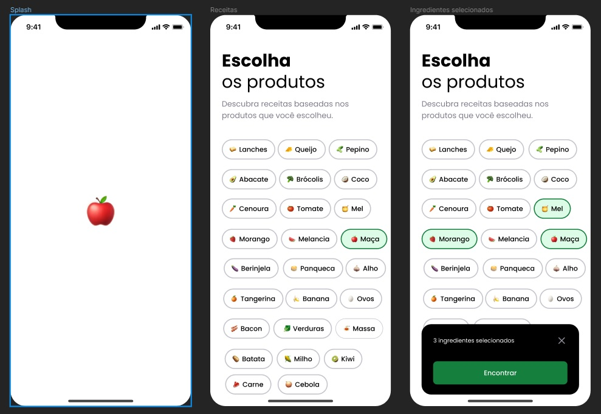
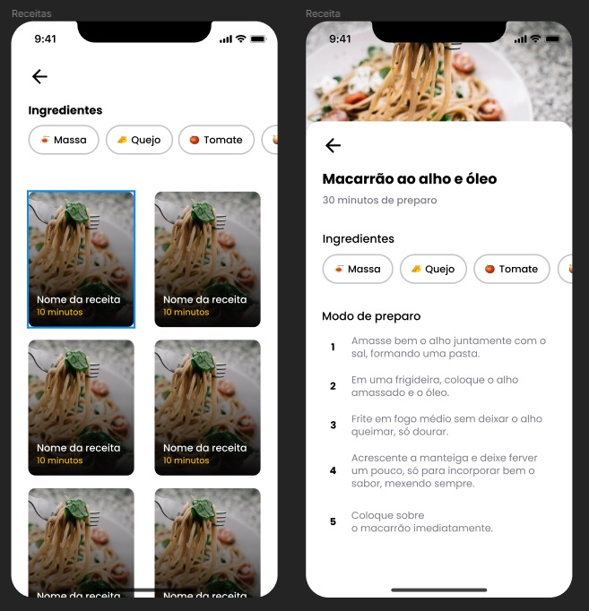

### Sobre o projeto

Imagine chegar em casa com fome depois de um dia de muito trabalho e lembrar que você esqueceu de passar no mercado para fazer as compras da semana. Então você decide abrir a geladeira pra fazer uma janta com o que já tem em casa, mas está sem muita criatividade pra cozinhar.
**É esse problema que o Cook App pode resolve!** Uma aplicação que sugere receitas conforme os ingredientes selecionados **usando React Native, Expo, Expo router, Supabase e React Native reanimated**.

**Supabase** Supabase é uma alternativa de código aberto ao Firebase, fornecendo recursos completos para desenvolver aplicativos, incluindo banco de dados Postgres, autenticação, APIs instantâneas e armazenamento, com capacidade de construção rápida e escalabilidade para milhões de usuários. 

---

<h1 align="center">
  
</h1>

<h1 align="center">
  
</h1>

---

### Install o projeto

npm install ou yarn install para instalar as dependências do projeto.

---

### Rodar o projeto

npx expo start ou expo start  para rodar a aplicação no modo de desenvolvimento.
